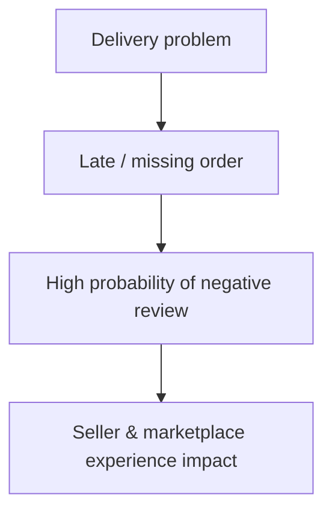

<div align="center">

<a href="https://git.io/typing-svg">
  
</a>

<br/>

[](https://python.org)
[](https://pandas.pydata.org)
[](https://jupyter.org)
[](https://www.kaggle.com/datasets/olistbr/brazilian-ecommerce)

<br/>

### 99,441 orders · 8 source tables · one pattern connecting delivery problems to **43.7%** of all 1–2 star reviews

**HVIA Data & AI Solutions — Business Discovery Task 01**

<br/>

<table>
  <tr>
    <th>🌎 Market</th>
    <th>📦 Orders</th>
    <th>🧩 Source tables</th>
    <th>⏱️ Data period</th>
    <th>📄 Deliverables</th>
  </tr>
  <tr align="center">
    <td><b>Brazil</b></td>
    <td><b>99,441</b></td>
    <td><b>8</b></td>
    <td><b>2016–2018</b></td>
    <td><b>Story deck + notebook</b></td>
  </tr>
</table>

<br/>

**[📓 Open the notebook](Olist_Analysis.ipynb)** &nbsp;·&nbsp; **[📊 View the story deck](Olist_Story_Report.pptx)** &nbsp;·&nbsp; **[🧾 results.json](results.json)**

</div>

---

## 📑 Contents

- [What is this?](#-what-is-this)
- [Project structure](#-project-structure)
- [Meet Olist](#-meet-olist)
- [The dataset](#-the-dataset)
- [How the analysis works](#-how-the-analysis-works)
- [Data quality & join safety](#-data-quality--join-safety)
- [Key findings](#-key-findings)
- [Business interpretation](#-business-interpretation)
- [Proposed solution](#-proposed-solution--delivery-intelligence--seller-health)
- [Pilot & roadmap](#-pilot--success-measurement)
- [Outreach](#-outreach)
- [Quick start](#-quick-start)
- [Tech stack](#-tech-stack)
- [Limitations](#-limitations)

---

## ✦ What is this?

A **data-first business discovery analysis of Olist**, prepared for the **HVIA Data & AI Solutions Business Discovery internship task**.

The goal was not to produce charts for their own sake. The work follows the task end to end:

> **business understanding → data inspection → cleaning → analysis → business findings → solution proposal → outreach**

### The headline finding

> **Late orders and orders that never arrive are about 10.8% of orders, but account for 43.7% of all 1–2 star reviews.**

This is an **association, not proof of causation.**

---

## ✦ Project structure

```text
HVIA_Task1_Olist/
├── 📓 Olist_Analysis.ipynb      # analytical source of truth
├── 📊 Olist_Story_Report.pptx   # business story, findings, solution, next steps
├── 🧾 results.json              # key metrics generated by the notebook
├── 📈 charts/                   # generated analysis charts
├── 🗃️ data/                     # source CSV files
└── 📖 README.md
```

> The notebook is the source of truth. `results.json` stores the key metrics used in the presentation.

---

## ✦ Meet Olist

Olist is a Brazilian e-commerce technology company that connects sellers with the online commerce ecosystem.

An important distinction is made throughout this analysis:

- **Sellers** are the businesses using Olist's platform.
- The people in the order and review data are **end shoppers**.
- The project data does **not** include the customer table needed for reliable repeat-buyer or customer-location analysis.

The analysis therefore sticks to what the data supports: orders, sellers, products, payments, reviews, delivery timing and seller geography.

---

## ✦ The dataset

The project contains **8 CSV files**:

| Table | Rows | Grain | Used for |
|---|---:|---|---|
| `olist_orders_dataset.csv` | 99,441 | 1 order | Order status and delivery timestamps |
| `olist_order_items_dataset.csv` | 112,650 | 1 order item | Items, sellers, price and freight |
| `olist_order_payments_dataset.csv` | 103,886 | 1 payment record | Payment analysis |
| `olist_order_reviews_dataset.csv` | 100,000 | Review + order | Review scores and comments |
| `olist_products_dataset.csv` | 32,951 | 1 product | Product / category analysis |
| `olist_sellers_dataset.csv` | 3,095 | 1 seller | Seller analysis |
| `olist_geolocation_dataset.csv` | 1,000,163 | ZIP-prefix record | Geographic reference |
| `product_category_name_translation.csv` | 71 | 1 category | Category translation |

### What the data can and can't answer

| Question | Answerable? |
|---|:---:|
| Review score | ✅ |
| Delivery timestamps | ✅ |
| Late-delivery rate | ✅ |
| Never-arrived orders | ✅ |
| Seller performance | ✅ |
| Seller location | ✅ |
| Product / category performance | ✅ |
| Payment behavior | ✅ |
| Customer location | ❌ |
| Repeat buyers | ❌ |
| Seller shipping-deadline compliance | ❌ |
| Costs / margins | ❌ |

The folder does **not** contain a `customers` table, `customer_unique_id`, `shipping_limit_date`, or any cost / margin data. So this version does **not** claim repeat-buyer or retention results, customer location or distance, official shipping-deadline compliance, or profit / margin impact. The notebook checks the available schema before making any claim.

---

## ✦ How the analysis works

| Step | What happens |
|---|---|
| **1. Business research** | Understand Olist, its marketplace model and business context |
| **2. File inspection** | Discover the actual files, rows, columns, missing values and grain |
| **3. Data validation** | Check keys, timestamps, duplicate relationships and join safety |
| **4. Cleaning** | Handle inconsistent records without silently hiding data-quality problems |
| **5. KPI analysis** | Orders, sales value, delivery performance and review score |
| **6. Business findings** | Growth, delivery, reviews, sellers, multi-seller orders, complaints, freight |
| **7. Interpretation** | Connect the findings into one business story |
| **8. Solution** | Propose *Delivery Intelligence & Seller Health* |
| **9. Pitch** | Turn the analysis into a practical outreach proposal |

---

## ✦ Data quality & join safety

### Data-quality checks

Issues found in the current files are documented, not hidden:

| Issue | Count |
|---|---:|
| Carrier pickup before purchase | **166** |
| Carrier pickup before payment approval | **1,359** |
| Delivery before carrier pickup | **23** |
| Delivered orders without delivery date | **8** |
| Delivery date present but status not delivered | **6** |
| Reviews written before purchase | **75** |
| Orders with 2+ review rows | **555** |
| Review IDs associated with another order | **827** |
| Products without English category translation | **13** |

### Join safety

Several tables hold multiple rows per order:

```text
order_items  ×  payments  ×  reviews
```

A direct join on `order_id` multiplies rows and inflates order counts, sales, averages, review metrics and delivery statistics. The notebook **aggregates to order level before combining tables**, preserving the correct analytical grain instead of producing inflated many-to-many results.

---

## ✦ Key findings

### 1. Order growth

- Orders grew about **+135%** comparing Jan–Aug 2018 with Jan–Aug 2017.
- Peak month: **November 2017 — 7,544 orders**.
- Average monthly volume in 2018: about **6,749 orders**.

The story isn't "orders keep accelerating": the data shows strong growth followed by a flatter period.

### 2. Delivery performance

- **7,827** late orders (**8.1%** late rate)
- **2,965** orders that never arrived
- **21.4%** late rate in **March 2018**, the worst month

| Metric | Days |
|---|---:|
| Promised delivery | **23.7** |
| Actual delivery | **12.6** |

A large average buffer does not prevent serious delivery failures in specific periods.

### 3. Delay → review score

| Delivery timing | Avg. review score |
|---|---:|
| On time | **4.28** |
| 1–3 days late | **3.75** |
| 3–7 days late | **2.30** |
| 7–14 days late | **1.74** |
| 14+ days late | **1.70** |

| Order group | Low-review rate (1–2 stars) |
|---|---:|
| On time | **9.5%** |
| Late | **54.6%** |
| Never arrived | **78.3%** |

> ⚠️ These are observed associations. They do not establish that delivery delay alone caused the review score.

### 4. The main business finding

| Group | Share of orders | Share of 1–2 star reviews |
|---|---:|---:|
| On time | **89.2%** | **56.3%** |
| Late | **7.9%** | **28.6%** |
| Never arrived | **2.9%** | **15.2%** |

**Late + Never arrived = 10.8% of orders → 43.7% of all 1–2 star reviews.**

This concentration makes delivery reliability a measurable business problem worth investigating.

### 5. Orders that never arrived

**2,965 orders**, with an average review score of **1.74**. Observed statuses:

| Status | Orders |
|---|---:|
| Shipped | **1,107** |
| Canceled | **619** |
| Unavailable | **609** |
| Invoiced | **314** |
| Processing | **301** |
| Delivered | **8** |
| Created | **5** |
| Approved | **2** |

### 6. Where delivery time goes

| Stage | On-time orders | Late orders |
|---|---:|---:|
| Payment approval | 0.4 days | 0.5 days |
| Seller handling | 2.6 days | 5.3 days |
| Carrier transit | 7.9 days | 25.7 days |

The biggest difference is **carrier transit**, but seller handling also grows on late orders:

| Seller handoff | Late rate |
|---|---:|
| Fast | **6.3%** |
| Slow | **16.6%** |

Because `shipping_limit_date` is not in the data, this is **not** a seller-deadline violation analysis.

### 7. Seller concentration

Sellers are scored only above a minimum order-volume threshold.

| Metric | Value |
|---|---:|
| Sellers in source data | **3,095** |
| Sellers scored | **634** |
| Share of sales covered by scored sellers | **~77%** |
| Sellers on the watch list | **101** |
| Share of sales from watch-list sellers | **~8.2%** |
| Share of sales from the top 10% of sellers | **~67%** |
| Median seller order count | **6** |

A relatively small group of sellers represents a large share of marketplace value.

### 8. Multi-seller orders

Among the relevant on-time orders (**1,257 multi-seller orders** in the analyzed subset):

| Order type | Avg. review score |
|---|---:|
| Single-seller | **≈ 4.30** |
| Multi-seller | **≈ 2.86** |

Again an association, not proof that multi-seller fulfillment lowers ratings.

### 9. Review comment themes

The notebook reads **11,363 review comments** and applies simple keyword-based themes (a comment can match more than one):

| Theme | Share |
|---|---:|
| Not received / late | **38.9%** |
| Only part arrived | **14.4%** |
| Defective / poor | **10.0%** |
| Wrong product | **8.4%** |

These are directional keyword themes, not a production NLP classifier.

### 10. Freight pressure

| Item price | Freight / item price |
|---|---:|
| < R$25 | **77%** |
| R$25–50 | **39%** |
| R$50–100 | **24%** |
| R$100–200 | **16%** |
| R$200+ | **8%** |

Overall freight is about **16.6%** of item price. This is a supporting finding, not the main story.

---

## ✦ Business interpretation

| Story | Evidence |
|---|---|
| **Delivery reliability affects customer experience** | Late and never-arrived orders are ~10.8% of orders but 43.7% of 1–2 star reviews |
| **The problem is uneven** | Monthly late rates vary sharply, reaching 21.4% in March 2018 |
| **The delay has identifiable stages** | Late orders spend far longer in carrier transit and also have longer seller handling |
| **Seller performance is concentrated** | The top 10% of sellers represent ~67% of sales |
| **The problem is measurable** | Order, seller, delivery-stage and review data can be combined to monitor risk |

The analysis does **not** claim delivery is the only reason for bad reviews. It identifies delivery reliability as the clearest measurable pattern in the supplied data.

---

## ✦ Proposed solution — Delivery Intelligence & Seller Health

| Module | What it does |
|---|---|
| 🚨 **Early-Warning Score** | Estimates late-delivery risk per order from signals like seller history, product characteristics and seasonality |
| 📋 **Seller Health Scorecard** | Tracks late rate, problematic orders, handling time and review trends per seller |
| 🎯 **Promise Calibration** | Uses historical delivery behavior to set more realistic delivery windows by operational segment and season |



The system moves the business from **reacting to failed deliveries** toward **identifying delivery risk earlier**.

---

## ✦ Pilot & success measurement

The solution should be validated in a controlled pilot rather than assuming correlation equals business impact.

**Suggested pilot metrics**

- Late-order rate
- Never-arrived rate
- 1–2 star review rate
- Review score among affected orders
- Seller-level delivery performance
- Accuracy of early-warning alerts

The current analysis is the historical baseline; the pilot should show whether intervention actually improves outcomes.

### Implementation roadmap

| Phase | Focus | Key actions |
|---|---|---|
| **Weeks 1–2** | Data & discovery | Confirm production data access · validate additional data needed · reconcile data-quality issues · define delivery and seller KPIs |
| **Weeks 3–6** | Seller health | Build seller scorecards · analyze peak-period behavior · create the first watch list · set up monitoring dashboards |
| **Weeks 7–12** | Early-warning pilot | Build a first risk-scoring model · select pilot sellers / segments · run with a control group · measure delivery and review outcomes |
| **Next phase** | Scale | Integrate validated risk scores into workflows · improve promise calibration · add production signals as available |

---

## ✦ Outreach

The outreach leads with the strongest evidence rather than a generic AI pitch:

> **Late and never-arrived orders represent about 11% of orders but account for about 44% of all 1–2 star reviews.**
>
> The analysis also shows where the delay is concentrated and which seller-level patterns are worth monitoring.
>
> The proposed next step is a Delivery Intelligence & Seller Health pilot that identifies risky orders earlier and gives Olist clearer visibility into delivery performance.

---

## ✦ Quick start

```bash
# 1. Clone the repository
git clone https://github.com/morad-elnahla/HVIA_Task1_Olist.git
cd HVIA_Task1_Olist

# 2. Install dependencies
pip install pandas numpy matplotlib jupyter

# 3. Open the notebook
jupyter notebook Olist_Analysis.ipynb
```

Then in Jupyter: **Restart Kernel → Run All → inspect results → review the generated charts → check `results.json`.**

---

## ✦ Tech stack

| Layer | Technology |
|---|---|
| 🐍 Language | Python 3.10+ |
| 🧮 Analysis | pandas, NumPy |
| 📊 Visualization | Matplotlib |
| 📓 Environment | Jupyter Notebook |
| 🗃️ Data | [Olist Brazilian E-Commerce Dataset](https://www.kaggle.com/datasets/olistbr/brazilian-ecommerce) |
| 📦 Output | JSON, charts, PowerPoint |

---

## ✦ Limitations

- **Historical dataset** — covers 2016–2018 and should not be read as Olist's current operations.
- **Association, not causation** — the analysis shows relationships between delivery outcomes and reviews, not that late delivery alone causes bad reviews.
- **No customer table** — no `customers` table or `customer_unique_id`, so repeat-buyer, retention and customer-location analysis are out of scope.
- **No shipping deadline** — `shipping_limit_date` is missing. Seller handling is measured from available timestamps; official deadline compliance is not claimed.
- **No financials** — no costs, commissions, profit or margins, so financial impact isn't calculated.
- **Keyword-based review themes** — approximate categories, not a production NLP model.
- **Data quality** — the source has timestamp and relationship inconsistencies, which the notebook detects and documents.

---

<div align="center">

**Built for the HVIA Data & AI Solutions · Business Discovery Internship Task**

**Morad El-Nahla · AI & Machine Learning Intern**

</div>
